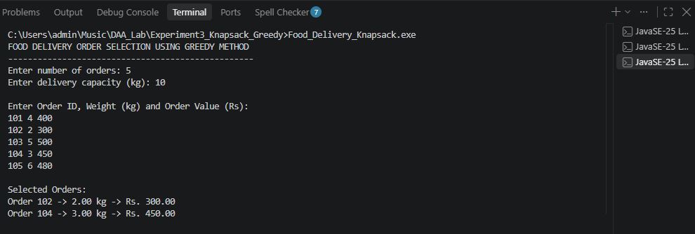
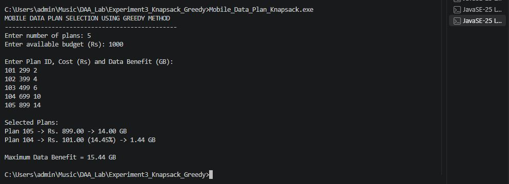
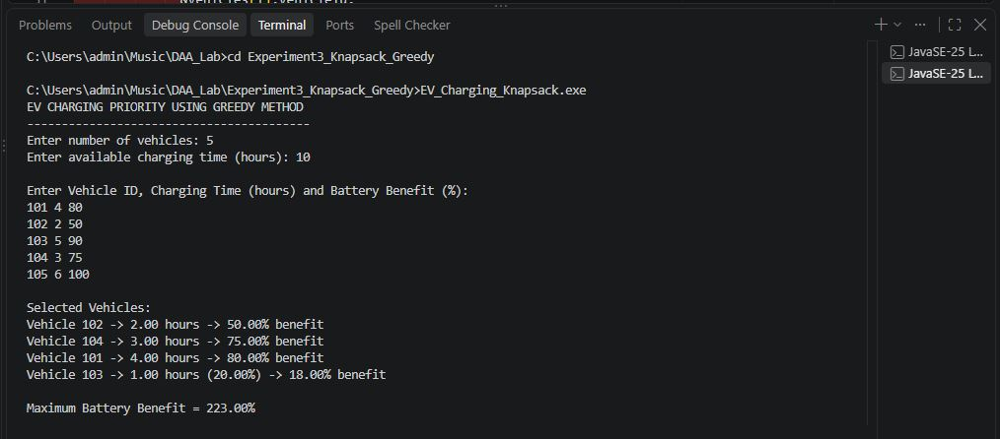

# Experiment No. 3

## Knapsack Problem Using Greedy Method

---

## Aim

To implement the **Knapsack Problem using the Greedy Method** and apply it to real-world applications.

---

## Objective

* To understand the concept of the Knapsack Problem.
* To understand the Greedy Method.
* To calculate the value-to-weight ratio.
* To select items with maximum benefit.
* To implement the Fractional Knapsack approach.
* To apply the Greedy Method to real-world applications.
* To analyze the time and space complexity.

---

## Theory

The **Knapsack Problem** is an optimization problem in which we have a limited capacity and several items with different weights and values.

The objective is to select items in such a way that the **maximum total value or benefit** is obtained without exceeding the available capacity.

In the **Greedy Method**, items are selected according to their **value-to-weight ratio**.

### Formula

```text
Ratio = Value / Weight
```

The item having the highest ratio is selected first.

This experiment uses the **Fractional Knapsack** approach, where a fraction of an item can also be selected when the remaining capacity is not sufficient.

---

# Applications

### 1. Food Delivery Order Selection

Select food delivery orders based on their order value and weight within the available delivery capacity.

**Source File:** `Food_Delivery_Knapsack.c`

### 2. Mobile Data Plan Selection

Select mobile data plans based on their data benefit and cost within a limited budget.

**Source File:** `Mobile_Data_Plan_Knapsack.c`

### 3. Electric Vehicle Charging Priority

Select EV charging requests based on battery benefit and charging time within limited charging time.

**Source File:** `EV_Charging_Knapsack.c`

---

# Application 1 — Food Delivery Order Selection

The program selects food delivery orders according to their **order value per kilogram**.

### Algorithm

1. Calculate value/weight ratio for every order.
2. Sort orders according to the ratio.
3. Select the order having the highest ratio.
4. Continue selecting orders while capacity is available.
5. If remaining capacity is insufficient, select a fraction of the order.
6. Calculate the maximum total order value.

### Source File

`Food_Delivery_Knapsack.c`

### Output



---

# Application 2 — Mobile Data Plan Selection

The program selects mobile data plans according to their **data benefit per rupee**.

### Algorithm

1. Calculate benefit/cost ratio for every plan.
2. Sort plans according to the ratio.
3. Select the plan having the highest ratio.
4. Continue selecting plans while the budget is available.
5. Select a fraction when the remaining budget is insufficient.
6. Calculate the maximum data benefit.

### Source File

`Mobile_Data_Plan_Knapsack.c`

### Output



---

# Application 3 — Electric Vehicle Charging Priority

The program gives charging priority to vehicles according to their **battery benefit per charging hour**.

### Algorithm

1. Calculate battery benefit/charging time ratio.
2. Sort vehicles according to the ratio.
3. Select the vehicle having the highest ratio.
4. Continue selecting vehicles while charging time is available.
5. Select a fraction when the remaining charging time is insufficient.
6. Calculate the maximum battery benefit.

### Source File

`EV_Charging_Knapsack.c`

### Output


---

# Time Complexity

The programs sort the items according to their value-to-weight ratio.

```text
Sorting Time Complexity = O(n²)
Selection Time Complexity = O(n)

Overall Time Complexity = O(n²)
```

---

# Space Complexity

The programs use arrays and structures to store the items.

```text
Space Complexity = O(n)
```

---

# Advantages

* Simple and easy to implement.
* Gives a good solution for optimization problems.
* Efficient for Fractional Knapsack.
* Uses a logical selection strategy.
* Useful in real-world resource allocation problems.

---

# Limitations

* Greedy Method does not always give the optimal solution for 0/1 Knapsack.
* The Fractional Knapsack approach allows partial selection.
* The solution depends on the selected ratio.
* Sorting is required before selecting items.

---

# Applications

The Knapsack Problem using the Greedy Method can be used in:

* Food Delivery Order Selection
* Mobile Data Plan Selection
* EV Charging Priority
* Resource Allocation
* Budget Planning
* Transportation
* Network Bandwidth Allocation
* Storage Management
* Load Management

---

# Conclusion

The **Knapsack Problem using the Greedy Method** was successfully implemented using the **Fractional Knapsack approach**.

Three real-world applications were implemented:

1. Food Delivery Order Selection
2. Mobile Data Plan Selection
3. Electric Vehicle Charging Priority

The programs calculate the value-to-weight ratio and select items with the highest ratio to obtain the maximum possible benefit within the given capacity.
